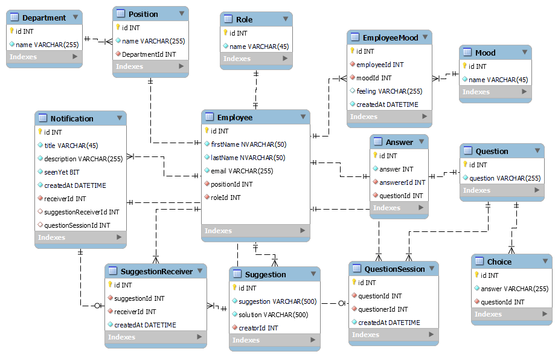

  <a href="https://github.com/ThisGameZR/MEMT" style="font-size:1.5rem; text-align:center;">MEMT</a>
  <a href="https://github.com/ThisGameZR/MEMT/tree/main/Document/SoftwareRequirements" style="font-size:1.1rem; text-align:center;">SRS</a>
  <a href="https://github.com/ThisGameZR/MEMT/tree/main/Document/SystemOverview" style="font-size:1.1rem; text-align:center;">System Overview</a>
  <a href="https://github.com/ThisGameZR/MEMT/tree/main/Document/UseCaseModel" style="font-size:1.1rem; text-align:center;">Use Case Model</a>
  <a href="https://github.com/ThisGameZR/MEMT/tree/main/Document/API" style="font-size:1.1rem; text-align:center;">API reference</a>

### <b style="text-decoration: underline">System Function Overview</b>

### <b style="text-decoration: underline">Database ER Diagram</b>

### <b style="text-decoration: underline">System Architecture Diagram</b>

### <b style="text-decoration: underline">System Logic</b>

- User Interface Layer

  The User Interface Layer will consist of everything shown directly to the client. This Layer will communicate only with the Application Logic Layer. This Layer will also be responsible for initial validation of any user inputted data. Any validation that requires communication to the Data Storage Layer will however be completed at the Logic Layer.

- Application Logic Layer

  This layer will be responsible for providing a secure connection to the Data Storage Layer and formatting information received from the SQL Server using **ASP .NET CORE ENTITY FRAMEWORK** as an ORM for presentation to the User Interface Layer. Scripts that return user specific data, such as advisory stream selection will be run on the Data Storage Layer.

- Data Storage Layer

  The Data Storage Layer will record all information required by the Logic and User Interface Layer. This data will include Subject details for the Streams, and general user and admin user information. All passwords stored in the database will be encrypted to prevent unauthorized access. Within the Data Storage Layer a collection of SQL Queries will provide access to the data in a meaningful way.
